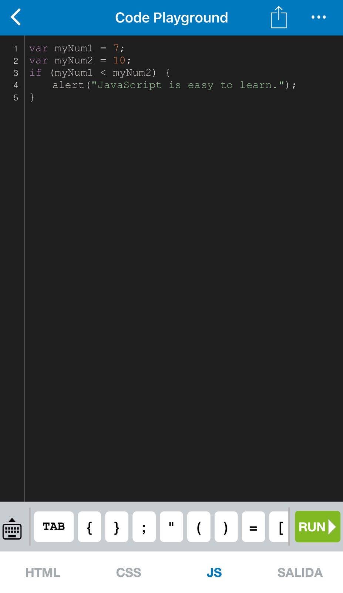

# Aprende un lenguaje de programación en un día (ejercicio voluntario para subir nota).

## Introducción

Cuando te sacaste el carnet de conducir, aprendiste las normas de circulación así como los fundamentos básicos para manejar un coche: volante, marchas, freno, acelerador, embrague, retrovisores... Seguramente, el coche que conduces ahora es diferente al que utilizaste para aprender a conducir, no obstante, lo puedes llevar sin problema. Cada coche tiene sus peculiaridades, pero quien sabe manejar un automóvil, puede adaptarse a las medidas, tacto y comportamiento de un vehículo en cuestión de horas.

Aprender a programar es como aprender a conducir. Si tienes una base sólida de programación y sabes manejar con soltura los tipos de datos, bucles, arrays, clases, métodos, etc. podrás pasar de un lenguaje a otro en un período relativamente corto, simplemente tendrás que adaptarte a la sintaxis y a las peculiaridades del nuevo lenguaje.

Con este ejercicio se pretende despertar el interés por otros lenguajes de programación distintos al que el alumno está estudiando como primer lenguaje.

Sigue los pasos que se indican a continuación.

## Miembros del grupo

Los miembros del grupo, el primero es el representante o encargado.

* [Lucía Flores Padilla](https://github.com/luciaflores25)
* [Jesus Martín Castro](https://github.com/Jesusmc82)
* [Beatriz Parejo Ramos](https://github.com/BeatrizPR)

## Lenguaje de programación

Lenguaje de programación elegido por el grupo.

* JavaScript

* En el siguiente documento se encuentra una [Guía de JavaScript](GuiaJavaScript.pdf) by miembros de este grupo.

## Información sobre el lenguaje

JavaScript es uno de los lenguajes de programación más populares en el mundo y se utiliza para procesar datos, añadir interactividad a páginas web y además, poder crear diferentes tipos de apliciones como aplicaciones de escritorio, móviles, juegos, etc.

Podemos ver información de JavaScript en distintas páginas:
* [Página de JavaScript](https://www.javascript.com/)
* [Guia de JavaScript de Mozilla](https://developer.mozilla.org/es/docs/Web/JavaScript/Guide)
* [JavaScript.Info](https://javascript.info/)
* [Información general de Mozilla](https://developer.mozilla.org/es/docs/Web/JavaScript)

También, encontramos información interesante para aprender sobre JavaScript en la página de Codecademy:
* [JavaScript en Codecademy](https://www.codecademy.com/es/tracks/javascript)

Podemos aprender JavaScript desde la app para Iphone y Android llamada "SoloLearn", aquí se adjuntan algunas imágenes de su funcionamiento:

     


## Herramientas de desarrollo

Para hacer los ejercicios hemos usado netbeans, aunque JavaScript se puede programar en cualquier IDE, Eclipse, Notepad++, Sublime Text, BlueGriffon, Microsoft Visual Studio Express for Web o Aptana Studio, entre otros.


## Poniendo en práctica el lenguaje

### 1. ¡Hola mundo!

Realiza un programa que muestre por pantalla la frase **¡Hola mundo!**.

```java
    document.write("¡Hola Mundo!");
```

### 2. Pirámide

Dada una altura introducida por el usuario, realiza un programa que pinte una pirámide a base de asteriscos con la altura indicada.

```java
	var alturaIntroducida = prompt("Introduce la altura de la pirámide: ");
        var caracterIntroducido = prompt("Ahora introduce el carácter con el que quieras pintarla: ");
        
        var altura = 1;
        var espacios = (alturaIntroducida -1);
        var caracter = 1;
        
        while(altura <= alturaIntroducida){
            for(var i = 1; i <= espacios; i++){
                document.write("&nbsp");
            }
            
            for(var i = 1; i <= caracter; i++){
                document.write(caracterIntroducido);
            }
            altura++;
            document.write("</br>");
            espacios--;
            caracter+=2;
        }
```

  

### 3. Arrays y números aleatorios

Realiza un programa que rellene un array (o una estructura similar) con 20 números enteros aleatorios entre 1 y 100 y que seguidamente los muestre por pantalla. A continuación, se deben pasar los números primos a las primeras posiciones del array y los no primos a las posiciones restantes. Muestra finalmente el array resultado.

```java
	var num = 0;
        var inicial = new Array(20);
        var primos = new Array(20);
        var noPrimos = new Array(20);
        var contadorPrimos = 0;
        var contadorNoPrimos = 0;
        var esPrimo = true;
        
        for(var i = 0; i < 20; i++){
        num = Math.floor(Math.random() * 100 + 1);
        inicial[i] = num;
        
        //Aquí se comprueba si los números aleatorios son primos
        var comprobacion = 0;
        esPrimo = true;
      
        for(var j = 2; j < inicial[i]; j++){
          comprobacion = inicial[i] % j;

          if(comprobacion == 0){
            esPrimo = false;
          }
        }
        
        if(esPrimo){
        primos[contadorPrimos] = inicial[i];
        contadorPrimos++;
        
        }else{
          noPrimos[contadorNoPrimos] = inicial[i];
          contadorNoPrimos++;
        }
      }

      document.write("Array inicial" + "</br>");
      for(var i = 0; i < 20; i++){
        document.write(inicial[i] + "  ");
      }

      document.write("</br></br>" + "Array resulltado de primos primero: " + "</br>");
      for(var i = 0; i < 20; i++){
        if (primos[i] != null){
          document.write(primos[i] + "  ");
        }
      }
      for(var i = 0; i < 20; i++){
     
        if (noPrimos[i] != null){
          document.write(noPrimos[i] + "  ");
        }
      }
```


## Presentación de resultados

Cada equipo explicará al resto de la clase lo aprendido durante la realización del ejercicio. Todos los miembros de cada equipo deben participar en la explicación. Se puede utilizar como material de base para la presentación el repositorio de GitHub.

## Recompensa

* Todos los alumnos que realicen correctamente la actividad tendrán 0'25 puntos extra en la nota del trimestre.

* Los miembros del equipo más votado ganarán un premio.

:star: Si te ha gustado este ejercicio, dale una estrellita al [repositorio original](https://github.com/LuisJoseSanchez/aprende-un-lenguaje-en-un-dia).

